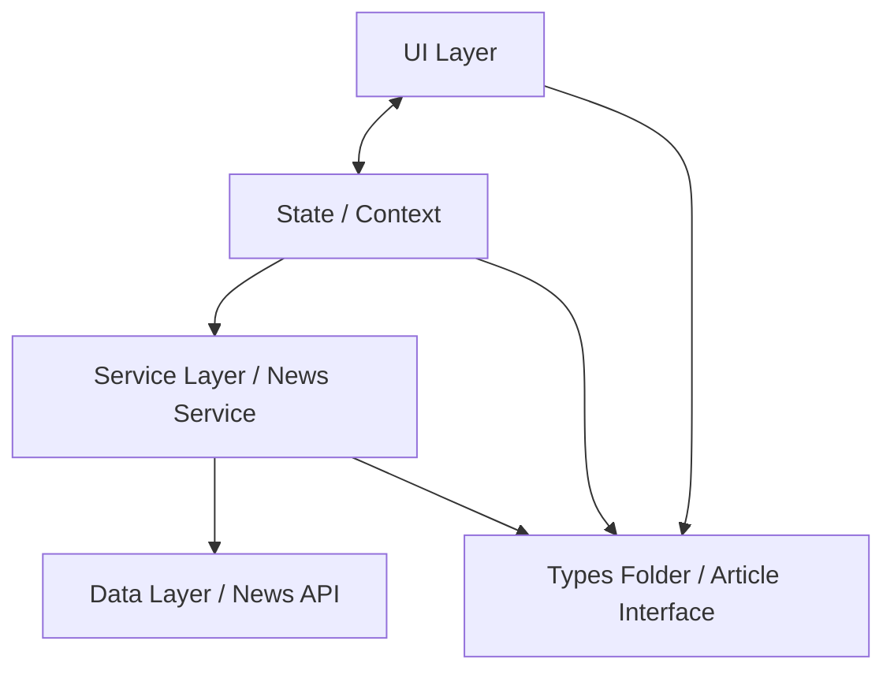

# Welcome to the News Market App

## Overview

This project is designed for users to have the ability to read news articles from different domains such as `Apple.com, bbc.com, ign.com, google.com, youtube.com.`

The user can select the 10 latest articles by domain with an option to sort by the most popular articles.

> **Note**: Make sure you have completed the [Set Up Your Environment](https://reactnative.dev/docs/set-up-your-environment) guide before proceeding.

# Getting Started

## Step 1: Start Metro server

First, make sure you are in the `NewsMarket` directory that lives inside your root folder. 

```sh
# Go into NewsMarket directory from root
cd NewsMarket

# Install dependencies
npm install
```

You will need to run **Metro**, the JavaScript build tool for React Native.

To start the Metro dev server, run the following command from the root of your React Native project:

```sh
# Using npm
npm start

# OR using Yarn
yarn start
```

## Step 2: Environment Variables

Create a `.env` file inside the `NewsMarket/` directory:

```sh
NEWS_API_KEY=your_api_key_here
```

Get a free API key at [newsapi.org](https://newsapi.org/register)

## Step 3: Build and run your app

With Metro running, open a new terminal window/pane from the root of your React Native project, and use one of the following commands to build and run your Android or iOS app:

### Android

```sh
# Using npm
npm run android

# OR using Yarn
yarn android
```

### iOS

For iOS, remember to install CocoaPods dependencies (this only needs to be run on first clone or after updating native deps).

> **Note:** iOS bundle requires Ruby 3.2.0+. If version is below, install via rbenv if needed:
> ```
> ruby -v # check version that you are using
> brew install rbenv
> rbenv install 3.2.0
> rbenv global 3.2.0
> echo 'eval "$(rbenv init -)"' >> ~/.zshrc
> source ~/.zshrc
> ruby -v  # verify version
> ```

The first time you create a new project, run the Ruby bundler to install CocoaPods itself:

```sh
bundle install
```

Then, and every time you update your native dependencies, run:

```sh
bundle exec pod install
```

For more information, please visit [CocoaPods Getting Started guide](https://guides.cocoapods.org/using/getting-started.html).

```sh
# Using npm
npm run ios

# OR using Yarn
yarn ios
```

If everything is set up correctly, you should see your new app running in the Android Emulator, iOS Simulator, or your connected device.

This is one way to run your app — you can also build it directly from Android Studio or Xcode.

# Architectural Decisions

This section covers the architectural decisions for this project. Please see below the system design approach: 

## System Design 



This is the System Diagram designed before implementation for a high-level approach of the solution. 

- **UI Layer** - This includes all the components and screens of the app.
- **State / Context** - This manages the global state of the app, includes fetching articles and selecting domains.
- **Service Layer** - This includes the News Service where the data is being fetched from the Data Layer.
- **Types Folder** - Contains all shared type definitions used across the app.
- **Data Layer** - This includes the News API where the data is being fetched externally.


## File Structure

```
news-market/
└── NewsMarket/
    ├── __tests__/        # unit tests
    ├── components/       # reusable UI components
    ├── constants/        # hardcoded app constants e.g. domains
    ├── context/          # Context API state management
    ├── hooks/            # custom React hooks
    ├── screens/          # app screens
    ├── services/         # News API service
    └── types/            # TypeScript type definitions
```

This is the file structure for the project setup which includes the UI, Context management, Hooks, Services, Type Definitions and Constants for a clean structure for any developer to use.

- **Libraries used** 
- Ruby versioning requires `3.2.0` for iOS bundle installs.
- Using `@types/jest` and `@types/node` for TypeScript type definitions in tests.

## State Management

The State Management solution that I used for this project would be Context API because it is great for small-to-medium sized applications, it is a lot more flexible and simpler to use for what I am fetching from the News API which is to read data and do some filtering. 

## Redux vs Context API vs Prop Drilling

I chose Context API over Redux because I felt that it might be over-engineering to use features like reducers and actions using Redux for a smaller sized project. I preferred Context API because it provides a cleaner approach to share values down a component tree without Prop Drilling.

# Testing

This project uses `@testing-library/react-native` for unit and integration tests.

To run the tests, make sure you are in the `NewsMarket` directory:

```sh

# from the root folder 
cd NewsMarket

# install dependencies
npm install

# run 
npm test
```

## Test Coverage
- **News Service** - Unit tests for `fetchNewsArticles`
- **Article Context** - Integration tests for state management
- **HomeScreen** - Integration tests for domain selection and article rendering
- **DomainPill** - Component unit tests
- **ArticleCard** - Component unit tests
- **SortButton** - Component unit tests

## Accessibility

All interactive components include `accessibilityRole`, `accessibilityLabel` and `accessibilityState` where appropriate to support screen readers.


# Assumptions and Trade-offs


- **NewsAPI Free Tier** - The free tier for the NewsAPI is limited to 100 requests per day. If for any reason, there are no articles showing, it may have reached the daily limit. Please try again the following day. 
- **Type Definitions** - The Article Type Definition is nullable for `source.id` and `description` after doing some research on the News API website and testing on Postman. Using `string | null` type to handle nullable API responses. 
- **Article URL Type Definition** - Article `url` type definition is used as a unique key rather than `source.id` because more than one article can have the same source.id and url provides a unique key for each and every article even if they share the same domain so this was more suitable. This removes the bug via source.id
- **Article Types with null values** - Articles with null descriptions is displayed as `No description available` fallback to ensure a consistent UI experience. 
- **Truncation** - The description and content values have a lot of information so truncation to 3 lines helps for cleaner UX.
- **Article Limit** - Articles are limited to 10 per request using the pageSize param as per brief requirement. 

# Known Limitations
- **Test Warnings** - act() warnings are a known compatibility issue between `React 19 and React Testing Library`. All tests pass correctly.

# Next Steps

- **Read More button** - It would be useful to add a 'Read More' button on each Article Card component so that the user can be re-directed to the browser via the source URL to read more information about the article. This will also provide a clean UX on the cards.
- **Add Domain Logo/Icons** - A nice feature would be to add article logos to Domain Pill Component for a cleaner, professional look.
- **Pagination & Infinite Scroll** - To display more than 10 articles for a seamless UX List experience.
- **NewsAPI Description Type Limitations** - The description type definition includes some URL values rather than normal text, this may be a data quality limitation due to the free trial tier being used.
- **Add Caching** - Implement local caching to avoid repeated API calls when toggling sort order
- **Navigation** - For future screens like `Article Details Screen` to show more details of the article to expand article list when truncated.
- **Test Structure** - For a larger scale app, tests would be organised into subfolders mirroring the src structure e.g. `__tests__/components/`, `__tests__/services/`


# Troubleshooting

If you're having issues getting the above steps to work, see the [Troubleshooting](https://reactnative.dev/docs/troubleshooting) page.
