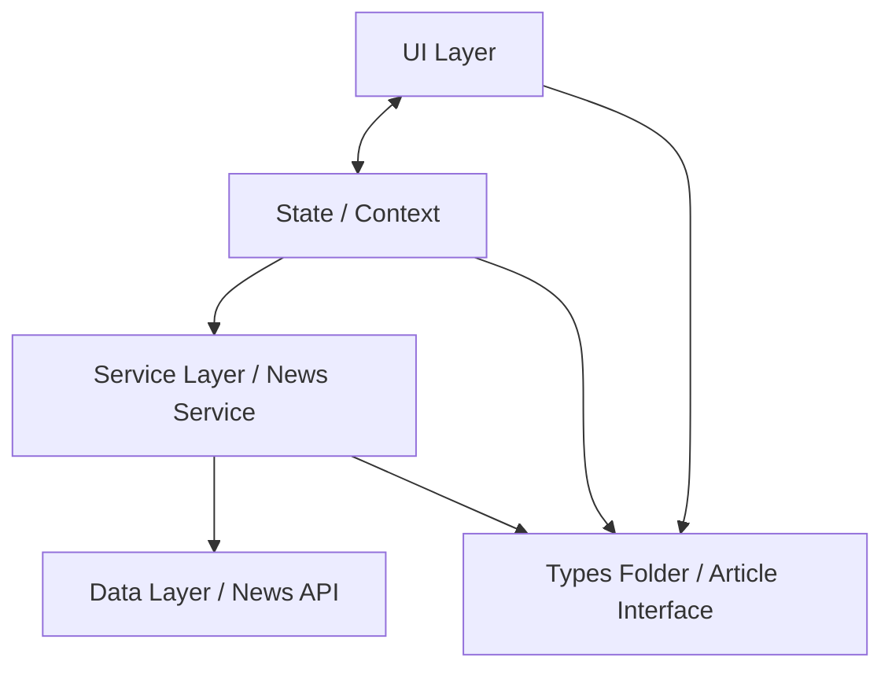

# Welcome to the News Market App

## Overview

This project is designed for users to have the ability to read news articles from different domains such as `Apple.com, bbc.com, ign.com, google.com, youtube.com.`

The user can select the 10 latest articles by domain with an option to sort by the most popular articles.

> **Note**: Make sure you have completed the [Set Up Your Environment](https://reactnative.dev/docs/set-up-your-environment) guide before proceeding.

# Getting Started

## Step 1: Start Metro server

First, make sure you are in the `NewsMarket` directory that lives inside your root folder. 

```sh
# Go into NewsMarket directory from root
cd NewsMarket
```

You will need to run **Metro**, the JavaScript build tool for React Native.

To start the Metro dev server, run the following command from the root of your React Native project:

```sh
# Using npm
npm start

# OR using Yarn
yarn start
```

## Step 2: Build and run your app

With Metro running, open a new terminal window/pane from the root of your React Native project, and use one of the following commands to build and run your Android or iOS app:

### Android

```sh
# Using npm
npm run android

# OR using Yarn
yarn android
```

### iOS

For iOS, remember to install CocoaPods dependencies (this only needs to be run on first clone or after updating native deps).

The first time you create a new project, run the Ruby bundler to install CocoaPods itself:

```sh
bundle install
```

Then, and every time you update your native dependencies, run:

```sh
bundle exec pod install
```

For more information, please visit [CocoaPods Getting Started guide](https://guides.cocoapods.org/using/getting-started.html).

```sh
# Using npm
npm run ios

# OR using Yarn
yarn ios
```

If everything is set up correctly, you should see your new app running in the Android Emulator, iOS Simulator, or your connected device.

This is one way to run your app — you can also build it directly from Android Studio or Xcode.

# Architectural Decisions

This section covers the architectural decisions for this project. Please see below the system design approach: 

## System Design 



#### UI Layer
This includes all the components and screens of the app.
#### State / Context
This manages the global state of the app, includes fetching articles and selecting domains.
#### Service Layer 
This includes the News Service where the data is being fetched from the Data Layer.
#### Types Folder 
The Types includes  type definitons of the app.
#### Data Layer
This includes the News API where the data is being fetched externally.


## File Structure

This is the file structure 

/news-market
 /NewsMarket
  /__tests__        # test files
  /components       # reusable UI components
  /context          # Context API state Management
  /hooks            # custom React hooks
  /screens          # app screens
  /services         # News API service
  /types            # TypeScript type definitions

# Troubleshooting

If you're having issues getting the above steps to work, see the [Troubleshooting](https://reactnative.dev/docs/troubleshooting) page.
